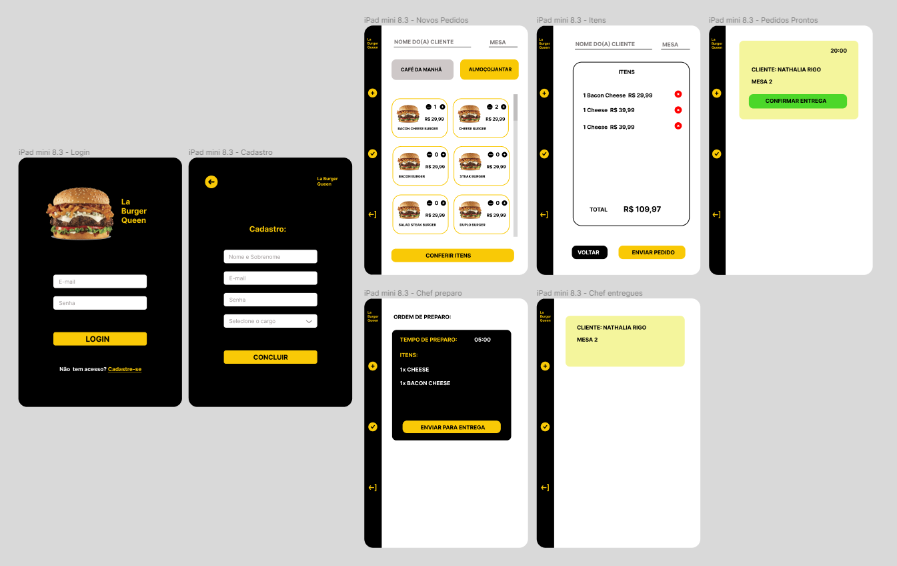

  <b>Quarto projeto</b> desenvolvido no Bootcamp da Laboratoria  
  por <b>Nathalia Rigo</b> 
  Status: Em desenvolvimento😉

## Índice

* [1. Resumo do projeto](#2-resumo-do-projeto)
* [2. Principais critérios para o desenvolvimento do projeto](#4-principais-critérios-para-o-desenvolvimento-do-projeto)
* [3. Protótipo de Alta Fidelidade](#6-protótipo-de-alta-fidelidade)
* - [3.1 - Paleta de cores](#61-paleta-de-cores)
* [4. Ferramentas e tecnologias utilizadas](#7-ferramentas-e-tecnologias-utilizadas)

## 1. Resumo do projeto

Um pequeno restaurante de hambúrgueres, que está crescendo, necessita uma interface em que se possa realizar pedidos utilizando um tablet, e enviá-los para a cozinha para que sejam preparados de forma ordenada e eficiente.

Este projeto tem duas áreas: interface (cliente) e API (servidor). Nosso cliente nos pediu para desenvolver uma interface que se integre com a API.

## 2. Principais critérios para o desenvolvimento do projeto

• Construir a tela para uso no tablet; 
• Usar React; 
• Consumir a API <a href="https://lab-api-bq.onrender.com/api-docs/">Burger Queen API</a>. 

## 3. Protótipo de Alta Fidelidade

• Tablet:
 

<!-- ### 3.1 Paleta de Cores

 -->

## 4. Ferramentas e tecnologias utilizadas

• <b>Notion</b> para o planejamento/tasks (Metodologia SCRUM);  
• <b>Figma</b> para o protótipo de alta fidelidade;  
• <b>HTML, CSS e JavaScript</b> para o desenvolvimento;  
• 
